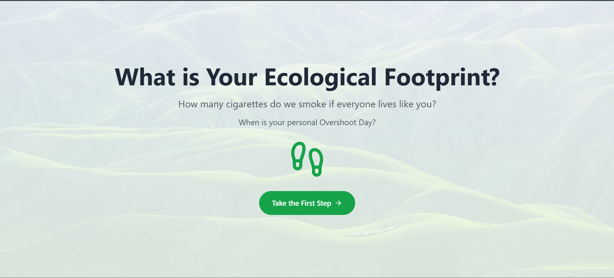
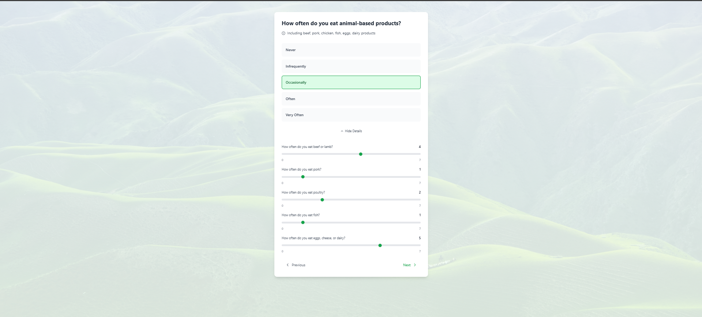
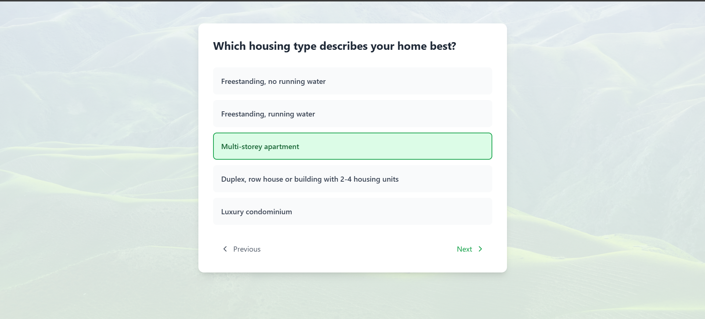
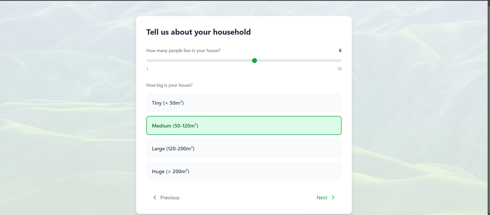
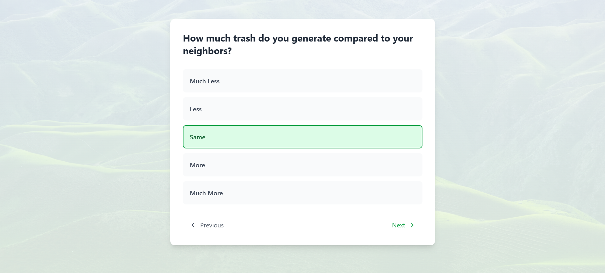
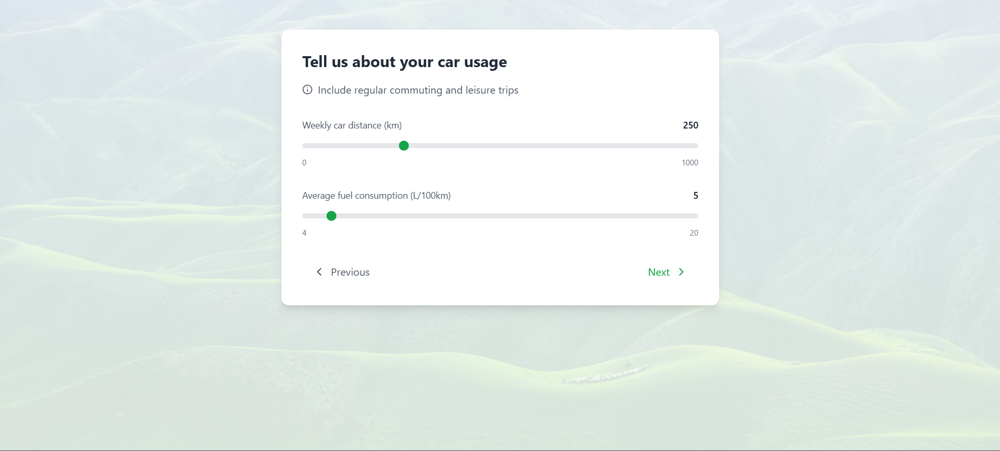
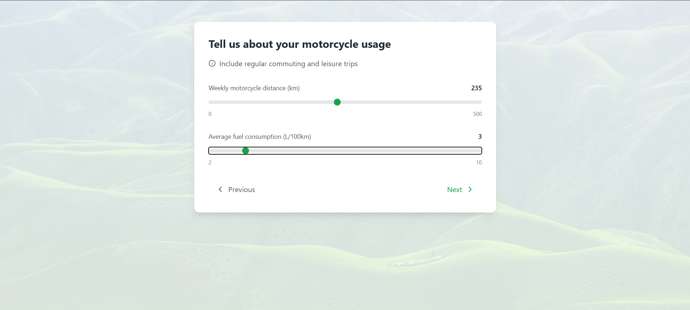
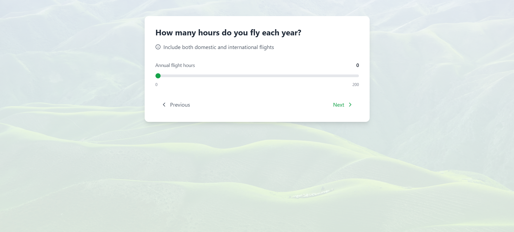
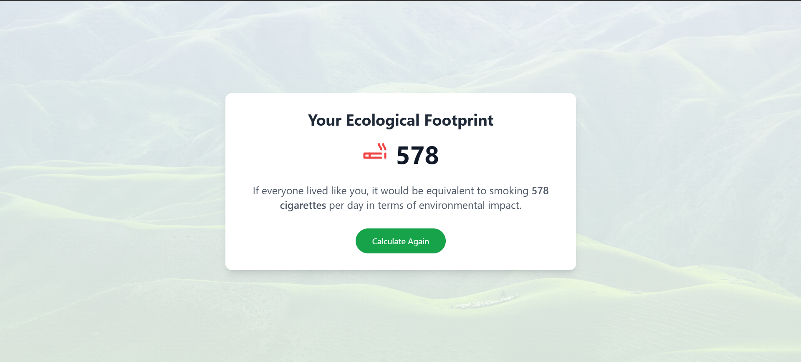

# **Ecological Footprint App**
## *Build With Qwikzen Group India*

Welcome to the **Ecological Footprint App**, an engaging and educational web application that helps users calculate their ecological footprint based on lifestyle choices and habits. The app offers an intuitive, visually appealing, and interactive experience to promote eco-conscious living.

---

## **Overview**

The **Ecological Footprint App** empowers users to reflect on their environmental impact by calculating the CO2 equivalent of their daily activities. The results are presented in terms of "cigarettes burnt," making the data relatable and impactful.

---

## **Key Features**
- **Interactive Questions:**
  - Analyze food consumption patterns.
  - Evaluate housing and transportation habits.
  - Provide tailored insights for eco-friendly choices.
- **Dynamic User Interface:**
  - Multi-choice options and sliders for inputs.
  - Visually stunning, eco-themed designs.
- **Real-Time Calculations:**
  - Converts user inputs to CO2 equivalents.
  - Results presented in an easy-to-understand format.

---

## **Technologies Used**

- 
- 
- 
- 
- 
- 

---

## **Deployed Application**

Access the live version of the app here: [Ecological Footprint App](https://stackblitz.com/edit/sb1-ztesuwh8)

---

## **How It Works**

1. **Start the Journey:** Begin with the bold question, "What is Your Ecological Footprint?" followed by simple prompts like "Calculate My Footprint."
2. **Interactive Modules:**
    - **Food:** Analyze your diet habits (e.g., frequency of animal-based products).
    - **Housing:** Consider housing type, materials, and waste generation.
    - **Transportation:** Evaluate travel habits (car, bike, public transport, and flights).
3. **Calculate Impact:** Results are displayed as CO2 equivalents and translated into cigarettes burnt for relatable understanding.

---

## **Design Highlights**

- **Eco-Friendly Color Palette:** Calming shades of green, blue, and yellow.
- **Background Imagery:** Animated visuals of nature, farms, homes, and transportation.
- **User-Friendly Inputs:** Sliders, multiple-choice options, and detailed prompts.

---

### ScreenShots**

## Contact
For any inquiries or feedback, feel free to reach out:
- **Email:** dspraneeth07@gmail.com
---

_Thank you for exploring the Ecological Footprint App! Together, we can make a positive environmental impact._
